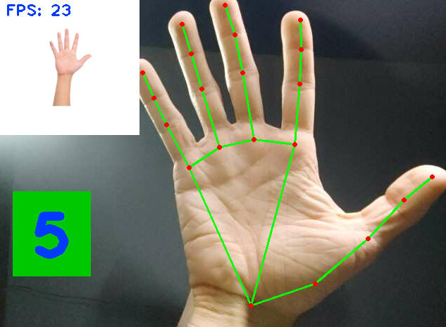

# Finger-Counter
Image recognition program that detects the gestures of the hand for counting from 0 to 5. Inspired by the freeCodeCamp course on Computer Vision.

This simple program uses the hand tracking module (https://github.com/NikoSilveira/Image-Recognition-Modules/tree/main/1.%20Hand%20Tracking) to scan the positions of the fingertips relative to the phalanges to determine how many fingers are "up" at a given time. Can be utilized for further development of more advanced applications.

